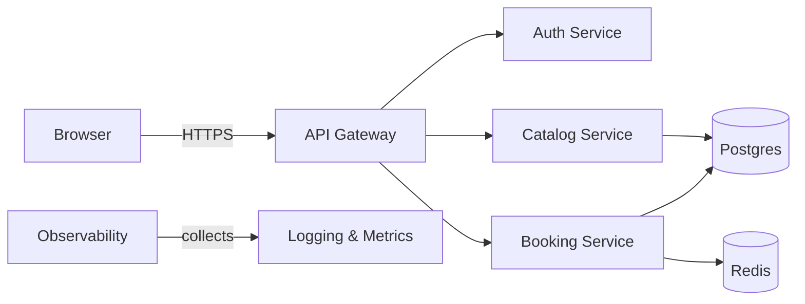

# To-Be Architecture Design

## Overview

The recommended To‑Be architecture separates the monolith into logical modules while keeping a pragmatic, incremental migration path:

- Edge: HTTPS + CDN for static assets (if frontend SPA used)
- API Gateway / Ingress: TLS termination, routing, auth
- Auth Service: centralized authentication (OAuth2 / OpenID Connect; Spring Security)
- Booking Service: core booking business logic, transactions
- Catalog Service: flights, schedules, availability read model
- Customer Service: customer profiles and identity
- Shared Data: Postgres primary DB; Redis for caching/locks
- Observability: logs, metrics, tracing

## Component Responsibilities

- API Gateway: route requests to services and enforce auth
- Auth Service: sign-in, token issuance, session management
- Booking Service: seat allocation, booking transactions, payments (if added)
- Catalog Service: flight search and inventory
- Customer Service: user profiles, authentication hooks

## Interaction diagram

## Data design notes

- Use single Postgres cluster with schemas per service (or dedicated DB per service if strict isolation required).
- Apply migration scripts from `tools/migration/schema_postgres.sql` and validate with test datasets.

## Non-functional requirements

- Availability: design for 99.9% with horizontal scaling of services
- Performance: flight search should use read replicas and caching
- Security: secrets via Key Vault/Secrets Manager; TLS everywhere
