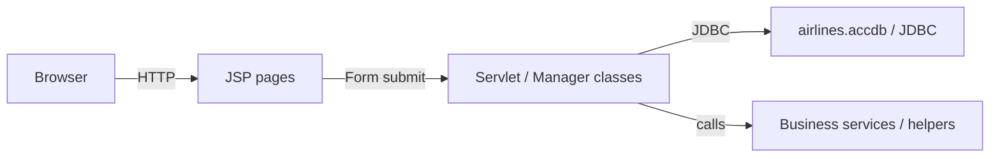

# Architecture Overview

## Architecture style

The application is a monolithic server-rendered web application using JSP and Java classes (Servlets/Managers). There is evidence of a separate Spring-based backend module in `backend-spring/` which may be a modernization effort or companion service.

## Major components

- Web UI: JSP pages under [Project/TurkishAirlines/web/](Project/TurkishAirlines/web/)
- Server-side logic: Java classes under [Project/TurkishAirlines/src/java/](Project/TurkishAirlines/src/java/)
- Data store: Microsoft Access DB file `airlines.accdb` (development) + SQL migration scripts to PostgreSQL
- Build: Ant/NetBeans (`build.xml`, `nbproject/`)

## Component responsibilities

- JSPs: render UI and submit forms
- Manager/Servlet classes: handle requests, business rules, and DB access
- Migration scripts: move data from Access to Postgres

## Component interactions (high level)

## Identified architectural risks

- Use of an Access DB (`airlines.accdb`) is a single-file, non-scalable datastore — high risk for concurrent usage and production readiness.
- Presentation logic mixed with business logic in JSPs/servlets increases maintenance cost.
- Lack of containerization or clear CI/CD manifests for modern deployment.

## Assumptions

- Needs confirmation: whether the `backend-spring/` module is actively used in production or is a migration target.
