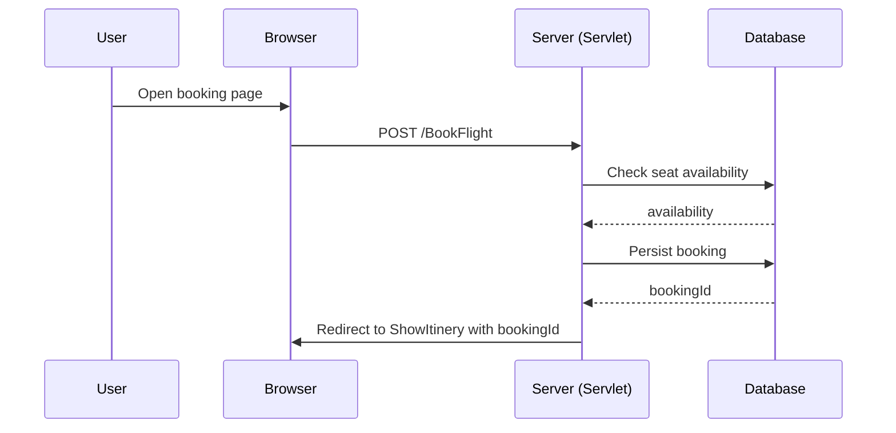

# Process Flows

## Main user journeys (high level)

1. Browse / Search flights
   - User visits `ShowFlights.jsp` and submits search criteria.
   - Server-side search logic queries DB and returns results.

2. Book flight
   - User selects a flight on `ShowFlights.jsp`, navigates to `BookFlight.jsp`.
   - User selects seats (`SetSeats.jsp`) and confirms.
   - Booking persisted to DB and `ShowItinery.jsp` displays confirmation.

3. Authentication
   - Login via `LoginManager.java` and relevant login JSP(s).

4. Admin approval
   - Admin views `ApproveFeatures.jsp` / `ApproveSeats.jsp` to accept requests or change availability.

## Background jobs / batch processes

- No scheduled jobs or workers were detected in a top-level scan. If any exist, they may be part of the `backend-spring/` module.

## Sequence diagram (booking)

